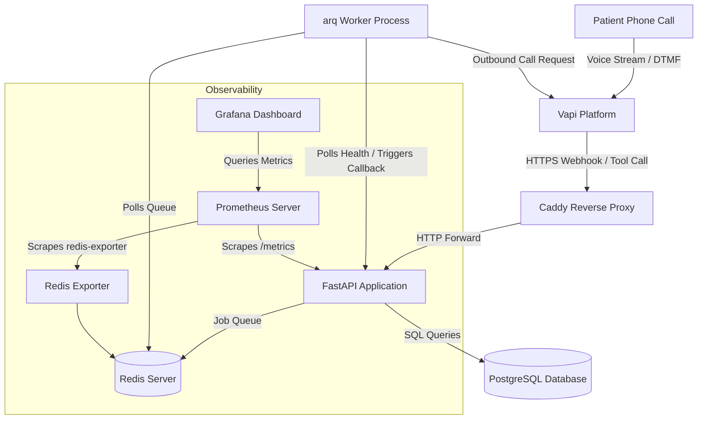

# Vapi Voice Platform Infrastructure & Operational Layer

This repository contains the production-honest backend, monitoring stack, deployment automation, and operational runbooks for a voice assistant platform integrated with Vapi.

## System Architecture

The platform architecture is designed to handle high-availability, low-latency webhook events from Vapi, with built-in resilience and self-healing mechanisms.



### Components:
1. **FastAPI app**: Ingests Vapi events (`call-start`, `tool-calls`, `call-end`, `transcript`), validates schemas, writes call records asynchronously, and returns tool execution results.
2. **PostgreSQL**: Stores relational calls and call events. Employs a unique constraint on `(call_id, event_type)` to handle webhook retries idempotently.
3. **Caddy**: Automates HTTPS via Let's Encrypt and routes external traffic to FastAPI.
4. **Redis + arq Queue**: Handles the failed interaction retry logic. When the sync path fails, a job is enqueued to check `/healthz` and place an outbound callback when the system recovers.
5. **Prometheus + Grafana**: Standard self-hosted observability, tracking requests, status codes (5xx rate), request duration histograms (p50/p95/p99), and Redis queue metrics.

---

## Automated Assistant Provisioning

To make setting up the assistant on Vapi easier, we have created an automation script: [create_assistant.py](file:///d:/Projects/Devops/CareCloud/va-platform/scripts/create_assistant.py).

Once you populate your **`VAPI_API_KEY`** (Private API Key) and your external **`DOMAIN`** (or your public ngrok URL if testing locally) in your [.env](file:///d:/Projects/Devops/CareCloud/va-platform/.env) file, you can run:
```bash
python scripts/create_assistant.py
```
This script will automatically:
1. Connect to the Vapi API.
2. Define the voice receptionist "Sarah" with the exact tools (`log_call_intent`) and parameter schemas expected by our backend.
3. Configure Vapi to forward all server webhooks to your domain (`https://<domain>/webhook`).
4. Write the resulting **`VAPI_ASSISTANT_ID`** directly back into your [.env](file:///d:/Projects/Devops/CareCloud/va-platform/.env) file.

---

## Deployment & Environments

The codebase isolates environments to avoid staging bugs affecting production data.

| Environment | Purpose | Infrastructure | Deploy Trigger |
| :--- | :--- | :--- | :--- |
| **Test** | CI validation | Ephemeral docker-compose | Every PR |
| **Staging** | QA & Demo | Contabo VPS (via Terraform) | Auto-deploy on merge to `main` |
| **Production** | Live Users | Existing Ubuntu VPS | Manual approval gate in GH Actions |

### 1. Provisioning Staging (Terraform)
Staging is provisioned cleanly via Terraform under `/infra`. Staging domain and DNS records are managed automatically through Namecheap.
To run Terraform:
```bash
cd infra
terraform init
terraform plan
terraform apply
```
*Note: Production was manually provisioned prior to this repository and is deployed only via GitHub Actions.*

### 2. GitHub Actions Secrets Configuration
Configure the following secrets in GitHub repository Settings under **Secrets and variables > Actions**:
- `SSH_PRIVATE_KEY`: Private SSH key authorized on the servers.
- `SSH_HOST_STAGING` / `SSH_HOST_PRODUCTION`: IP addresses of the servers.
- `SSH_USERNAME_STAGING` / `SSH_USERNAME_PRODUCTION`: Login usernames (e.g. `root`).
- `STAGING_DOMAIN` / `PRODUCTION_DOMAIN`: Configured domains (e.g. `staging.domain.com`).
- `STAGING_DB_USER` / `PRODUCTION_DB_USER` (etc.): Database credentials.
- `STAGING_VAPI_API_KEY` (etc.): Credentials for Vapi outbound API.
- `STAGING_GEMINI_API_KEY`: API Key for Google Gemini LLM.
- `STAGING_R2_ACCOUNT_ID` / `PRODUCTION_R2_ACCOUNT_ID`: Cloudflare account ID (from dashboard URL).
- `STAGING_R2_BUCKET` / `PRODUCTION_R2_BUCKET`: R2 bucket name.
- `STAGING_R2_ACCESS_KEY_ID` / `PRODUCTION_R2_ACCESS_KEY_ID`: R2 API token access key.
- `STAGING_R2_SECRET_ACCESS_KEY` / `PRODUCTION_R2_SECRET_ACCESS_KEY`: R2 API token secret key.

---

## Operations Guide

### 1. Operational Endpoints
- **Health check**: `https://<domain>/healthz` (Checks DB connectivity and returns the timestamp of the last processed call event).
- **Prometheus Metrics**: `https://<domain>/metrics` (Exposes application and queue metrics).
- **Grafana Dashboard**: Accessible at `http://<domain_or_ip>:3000` (Preloaded with Vapi metrics).

### 2. Viewing Logs
Connect to the VPS and run:
```bash
cd /opt/va-platform
docker compose logs -f app arq_worker
```
Every request logs as one structured JSON line to `stdout`:
`{"timestamp": "...", "call_id": "...", "event_type": "...", "latency_ms": 15, "status": 200, "error": null}`

### 3. Backups and Recovery
Backups run via the script `scripts/backup.sh` which executes `pg_dump`, compresses it, and uploads to your **Cloudflare R2** bucket using the AWS CLI with a custom endpoint URL (R2 is S3-compatible).

*   **Trigger a manual backup**:
    ```bash
    ./scripts/backup.sh
    ```
*   **Restore a backup (local or R2)**:
    ```bash
    ./scripts/restore.sh ./backups/backup_20260719_010000.sql.gz
    # OR directly from R2
    ./scripts/restore.sh s3://my-r2-bucket/backups/backup_20260719_010000.sql.gz
    ```
*   **Testing restore locally**:
    Run `./scripts/restore.sh <path>` and then query database tables:
    ```bash
    docker compose exec db psql -U postgres -d vapi_platform -c "SELECT COUNT(*) FROM calls;"
    ```

> **Note:** Backups require `R2_ACCOUNT_ID`, `R2_BUCKET`, `R2_ACCESS_KEY_ID`, and `R2_SECRET_ACCESS_KEY` to be set in `.env`. If unset, backups are retained locally only.

---

## Demo Script (Failure and Recovery)

Since the system supports live failure recovery, you can demo it using these steps:

### 1. Normal Path
Simulate a successful patient intent logging webhook request:
```bash
curl -X POST http://localhost:8000/webhook \
  -H "Content-Type: application/json" \
  -d '{
    "message": {
      "type": "tool-calls",
      "call": {
        "id": "demo-call-123",
        "customer": { "number": "+15551234567" }
      },
      "toolCalls": [
        {
          "id": "tc-demo-1",
          "type": "function",
          "function": {
            "name": "log_call_intent",
            "arguments": { "name": "Jane Doe", "dob": "1992-05-12", "reason": "prescription refill" }
          }
        }
      ]
    }
  }'
```
Response:
`{"results": [{"toolCallId": "tc-demo-1", "result": "Call intent logged: Patient Jane Doe (DOB: 1992-05-12) called for prescription refill."}]}`

### 2. Inject Failure
Stop the PostgreSQL database container:
```bash
docker compose stop db
```
Trigger the tool call again. The database failure will trigger the graceful fallback:
```bash
curl -X POST http://localhost:8000/webhook ...
```
Response:
`{"results": [{"toolCallId": "tc-demo-1", "result": "having trouble pulling that up, I\'ll have someone call you back"}]}`
*An `arq` background job (`failed-interaction`) is immediately enqueued. The worker starts polling `/healthz` every 5 seconds, retrying and backoff.*

### 3. Restore and Recover
Start the database container:
```bash
docker compose start db
```
The arq worker's next health check will succeed. The worker then calls Vapi's outbound calling API to trigger a callback to the user (`+15551234567`).

---

## Incident Runbook & Rollback

### 1. Detecting Anomalies
- **Error Spikes**: Monitor the "Error Rate" panel on the Grafana dashboard. If the 5xx rate exceeds 5%, Prometheus triggers an alert.
- **Latency Spikes**: The "Request Latency" panel displays p95 latency. If it exceeds 1 second, it indicates a bottleneck in Gemini API or database querying.

### 2. Checking Deploys
Check if the issue correlates with the latest deployment:
```bash
git log -n 5
# Compare the running container tag with current git history
docker inspect --format='{{.Config.Image}}' va-platform-app-1
```

### 3. Single-Command Rollback
If the latest deploy is buggy, you can roll back to the previous tag immediately.
```bash
# SSH into VPS, replace the IMAGE_TAG in .env with the previous stable git SHA, and restart:
sed -i 's/IMAGE_TAG=.*/IMAGE_TAG=<previous_stable_git_sha>/' .env && docker compose up -d
```

---

## Scaling to Production Traffic

If this platform serves real production traffic scaling to hundreds of thousands of concurrent calls:

### 1. Ingestion Separation (Message Broker)
Instead of handling database writes synchronously, separate FastAPI ingestion from processing. Webhook endpoints should only parse payloads, write them directly to a distributed event broker (e.g. Apache Kafka or RabbitMQ), and return HTTP 202 Accepted. Multiple background worker instances would consume the events and write them to Postgres asynchronously.

### 2. Database Scaling
- Implement read-replicas for Postgres to handle heavy dashboard/reporting queries.
- Set up connection pooling using `PgBouncer` to manage high concurrent connection counts.
- Apply partitioning on the `call_events` table by day or week to keep index sizes small and queries fast.

### 3. High Availability (HA) Deployments
- Run the FastAPI application tier across multiple instances in different availability zones behind a load balancer (e.g., AWS ALB or Cloudflare).
- Configure horizontal pod autoscaling (HPA) to scale containers up/down dynamically based on CPU/memory usage or HTTP request count.
