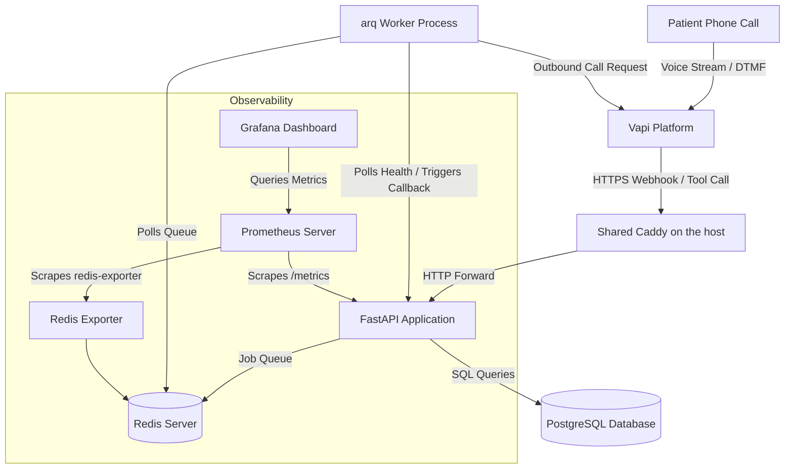

# Vapi Voice Platform Infrastructure & Operational Layer

This repository contains the production-honest backend, monitoring stack, deployment automation, and operational runbooks for a voice assistant platform integrated with Vapi.

## System Architecture

The platform architecture is designed to handle high-availability, low-latency webhook events from Vapi, with built-in resilience and self-healing mechanisms.



### Components:
1. **FastAPI app**: Ingests Vapi events (`call-start`, `tool-calls`, `call-end`, `transcript`), validates schemas, writes call records asynchronously, and returns tool execution results.
2. **PostgreSQL**: Stores relational calls and call events. Employs a unique constraint on `(call_id, event_type)` to handle webhook retries idempotently.
3. **Caddy**: Automates HTTPS via Let's Encrypt and routes external traffic to FastAPI. It is **not part of this stack** — one Caddy on the server fronts every project there and routes `va.shareeq.xyz` to this app by container name. Locally, `docker-compose.dev.yml` still runs its own using `Caddyfile.dev`.
4. **Redis + arq Queue**: Handles the failed interaction retry logic. When the sync path fails, a job is enqueued to check `/healthz` and place an outbound callback when the system recovers.
5. **Prometheus + Grafana**: Standard self-hosted observability, tracking requests, status codes (5xx rate), request duration histograms (p50/p95/p99), and Redis queue metrics.

---

## Automated Assistant Provisioning

To make setting up the assistant on Vapi easier, we have created an automation script: [create_assistant.py](file:///d:/Projects/Devops/CareCloud/va-platform/scripts/create_assistant.py).

Once you populate your **`VAPI_API_KEY`** (Private API Key) and your external **`DOMAIN`** (or your public ngrok URL if testing locally) in your [.env](file:///d:/Projects/Devops/CareCloud/va-platform/.env) file, you can run:
```bash
python scripts/create_assistant.py
```
This script will automatically:
1. Connect to the Vapi API.
2. Define the voice receptionist "Sarah" with the exact tools (`log_call_intent`) and parameter schemas expected by our backend.
3. Configure Vapi to forward all server webhooks to your domain (`https://<domain>/webhook`).
4. Write the resulting **`VAPI_ASSISTANT_ID`** directly back into your [.env](file:///d:/Projects/Devops/CareCloud/va-platform/.env) file.

---

## Deployment & Environments

The codebase isolates environments to avoid staging bugs affecting production data.

| Environment | Purpose | Infrastructure | Deploy Trigger |
| :--- | :--- | :--- | :--- |
| **Test** | CI validation | Ephemeral docker-compose | Every PR |
| **Staging** | QA & Demo | Its own Contabo VPS (via Terraform) | Push over SSH, auto on merge to `main` |
| **Production** | Live Users | Shared Ubuntu VPS, behind one proxy | Pull: a timer on the box follows the registry |

Staging and production are deployed by **different mechanisms, on purpose**.

Staging owns its host, so a push deploy is the simplest thing that works and
every green build lands there immediately — there is somewhere to look before
anything reaches users.

Production shares a server with four other projects, and that server's firewall
accepts nothing inbound except HTTP, HTTPS and Tailscale. A push deploy would
mean opening SSH to GitHub's runners and storing a key here that can log into
the box; across five repositories that is five keys and five ways in. So
production pulls instead: a systemd timer watches the registry and updates
itself (see `deploy/`). Nothing inbound, no key held here, and a machine that
was offline catches up on its own.

Both run the **same image** and the **same compose file**. Staging that differs
in shape from production is staging that tells you nothing.

### 1. Provisioning Staging (Terraform)
Staging is provisioned cleanly via Terraform under `/infra`. Staging domain and DNS records are managed automatically through Namecheap.
To run Terraform:
```bash
cd infra
terraform init
terraform plan
terraform apply
```
*Note: Production was manually provisioned prior to this repository and is deployed only via GitHub Actions.*

### 2. The reverse proxy, and why it is not in this stack

**What Caddy does here.** It is the only thing listening on ports 80 and 443.
Every request from the outside world arrives at Caddy, which:

- **Terminates HTTPS**, obtaining and renewing the Let's Encrypt certificate on
  its own — no certbot, no renewal cron, no expiry at 3am.
- **Routes by hostname.** `va.shareeq.xyz` goes to this app; other hostnames go
  to other projects on the same machine.
- **Forwards plain HTTP inward** to `va-app:8000` over a private Docker
  network, so the application never handles TLS and never needs a public port.
- Adds compression and the usual security response headers in one place,
  rather than each application doing it differently.

**Why it moved out of this compose file.** It used to run *inside* this stack,
on ports 8080/8443, behind another proxy at the edge. That was correct when
this project owned its server. It stopped being correct when four other
projects joined it.

With one proxy per project you get: two proxies in series for every request,
two places where routing lives, and two config files that will eventually
disagree about who terminates TLS — and the answer to "why is this URL 502"
becomes a two-step investigation. Certificates are worse: several proxies each
asking Let's Encrypt for certificates on the same machine is how you hit the
rate limit and lock yourself out for a week.

So there is one Caddy on the server, outside every project, and each project
joins a shared network called `edge` and is reached **by container name**. This
is also what removes host-port collisions permanently: three of these projects
each wanted to publish PostgreSQL on 5432, and only one could win. Once nothing
publishes a port, the question never comes up.

The routing table for all five projects lives in the `job-agent` repository, at
`deploy/Caddyfile`.

**Locally nothing changed:** `docker-compose.dev.yml` still runs its own Caddy
using `Caddyfile.dev`, because on a laptop there is no shared edge to join.

### 3. GitHub Actions Secrets Configuration
Configure the following in GitHub repository Settings under **Secrets and variables > Actions**.

Only **staging** is deployed from GitHub, so only staging secrets live here.
Production reads its values from a `.env` file on the server, which never
leaves that machine.

Until `SSH_HOST_STAGING` is set, the staging deploy **skips itself** rather
than failing — a pipeline that is always red is a pipeline nobody reads.

- `SSH_PRIVATE_KEY`: Private SSH key authorized on the staging host.
- `SSH_HOST_STAGING`: IP address of the staging server.
- `SSH_USERNAME_STAGING`: Login username (e.g. `root`).
- `STAGING_DOMAIN`: The staging domain (e.g. `staging-va.shareeq.xyz`).
- `STAGING_DB_USER` / `STAGING_DB_PASSWORD` / `STAGING_DB_NAME`: Database credentials.
- `STAGING_VAPI_API_KEY` / `STAGING_VAPI_ASSISTANT_ID` / `STAGING_VAPI_PHONE_NUMBER_ID`: Vapi API.
- `STAGING_GEMINI_API_KEY`: API key for Google Gemini.
- `STAGING_GRAFANA_ADMIN_USER` / `STAGING_GRAFANA_ADMIN_PASSWORD`: Grafana login. Both
  are required — compose refuses to start without them, so there is no default
  password to forget about.
- `STAGING_GRAFANA_URL`: Where Grafana is reachable, for links inside the app.
- `STAGING_R2_ACCOUNT_ID` / `STAGING_R2_BUCKET` / `STAGING_R2_ACCESS_KEY_ID` /
  `STAGING_R2_SECRET_ACCESS_KEY`: Cloudflare R2 backup target. All four, or the
  upload is skipped and backups stay on the same disk as the database.

The staging host needs the same one-time setup as production: Docker, and
`docker network create edge` — though the deploy creates that network itself if
it is missing, so a fresh box bootstraps without hand-holding.

---

## Operations Guide

### 1. Operational Endpoints
- **Health check**: `https://<domain>/healthz` (Checks DB connectivity and returns the timestamp of the last processed call event).
- **Prometheus Metrics**: `https://<domain>/metrics` (Exposes application and queue metrics).
- **Grafana Dashboard**: Accessible at `http://<domain_or_ip>:3000` (Preloaded with Vapi metrics).

### 2. Viewing Logs
Connect to the VPS and run:
```bash
cd /opt/va-platform
docker compose logs -f app arq_worker
```
Every request logs as one structured JSON line to `stdout`:
`{"timestamp": "...", "call_id": "...", "event_type": "...", "latency_ms": 15, "status": 200, "error": null}`

### 3. Backups and Recovery
Backups run via the script `scripts/backup.sh` which executes `pg_dump`, compresses it, and uploads to your **Cloudflare R2** bucket using the AWS CLI with a custom endpoint URL (R2 is S3-compatible).

*   **Trigger a manual backup**:
    ```bash
    ./scripts/backup.sh
    ```
*   **Restore a backup (local or R2)**:
    ```bash
    ./scripts/restore.sh ./backups/backup_20260719_010000.sql.gz
    # OR directly from R2
    ./scripts/restore.sh s3://my-r2-bucket/backups/backup_20260719_010000.sql.gz
    ```
*   **Testing restore locally**:
    Run `./scripts/restore.sh <path>` and then query database tables:
    ```bash
    docker compose exec db psql -U postgres -d vapi_platform -c "SELECT COUNT(*) FROM calls;"
    ```

> **Note:** Backups require `R2_ACCOUNT_ID`, `R2_BUCKET`, `R2_ACCESS_KEY_ID`, and `R2_SECRET_ACCESS_KEY` to be set in `.env`. If unset, backups are retained locally only.

---

## Demo Script (Failure and Recovery)

Since the system supports live failure recovery, you can demo it using these steps:

### 1. Normal Path
Simulate a successful patient intent logging webhook request:
```bash
curl -X POST http://localhost:8000/webhook \
  -H "Content-Type: application/json" \
  -d '{
    "message": {
      "type": "tool-calls",
      "call": {
        "id": "demo-call-123",
        "customer": { "number": "+15551234567" }
      },
      "toolCalls": [
        {
          "id": "tc-demo-1",
          "type": "function",
          "function": {
            "name": "log_call_intent",
            "arguments": { "name": "Jane Doe", "dob": "1992-05-12", "reason": "prescription refill" }
          }
        }
      ]
    }
  }'
```
Response:
`{"results": [{"toolCallId": "tc-demo-1", "result": "Call intent logged: Patient Jane Doe (DOB: 1992-05-12) called for prescription refill."}]}`

### 2. Inject Failure
Stop the PostgreSQL database container:
```bash
docker compose stop db
```
Trigger the tool call again. The database failure will trigger the graceful fallback:
```bash
curl -X POST http://localhost:8000/webhook ...
```
Response:
`{"results": [{"toolCallId": "tc-demo-1", "result": "having trouble pulling that up, I\'ll have someone call you back"}]}`
*An `arq` background job (`failed-interaction`) is immediately enqueued. The worker starts polling `/healthz` every 5 seconds, retrying and backoff.*

### 3. Restore and Recover
Start the database container:
```bash
docker compose start db
```
The arq worker's next health check will succeed. The worker then calls Vapi's outbound calling API to trigger a callback to the user (`+15551234567`).

---

## Incident Runbook & Rollback

### 1. Detecting Anomalies
- **Error Spikes**: Monitor the "Error Rate" panel on the Grafana dashboard. If the 5xx rate exceeds 5%, Prometheus triggers an alert.
- **Latency Spikes**: The "Request Latency" panel displays p95 latency. If it exceeds 1 second, it indicates a bottleneck in Gemini API or database querying.

### 2. Checking Deploys
Check if the issue correlates with the latest deployment:
```bash
git log -n 5
# What the running container is actually built from
docker inspect --format='{{.Config.Image}}' va-app
# When production last updated itself, and whether it succeeded
journalctl -u va-platform-update.service -n 30
```

### 3. Single-Command Rollback
Every build is tagged with its commit, so rolling back is pinning one.
```bash
# On the server: point .env at the last good commit and restart.
sed -i 's/IMAGE_TAG=.*/IMAGE_TAG=<previous_stable_git_sha>/' .env && docker compose up -d
```

This **survives the update timer**. `IMAGE_TAG` normally reads `main`, which
moves with every green build; setting it to a fixed commit means the timer keeps
pulling that same commit and finds nothing to change. The rollback holds until
you set the tag back to `main` deliberately — which is the behaviour you want at
2am, rather than an automatic re-deploy of the bad build five minutes later.

To stop deploys entirely while investigating:
```bash
sudo systemctl stop va-platform-update.timer
```
